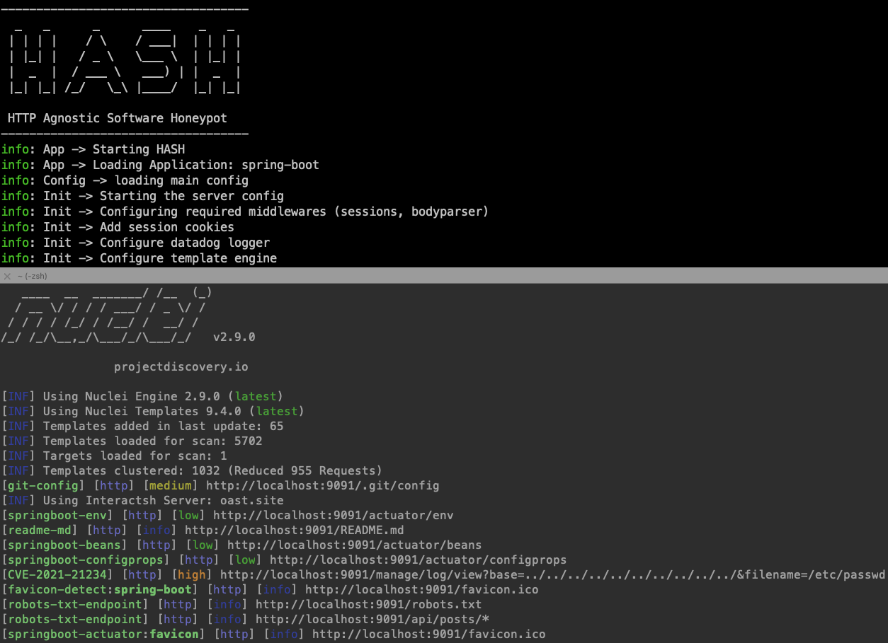

# HASH (HTTP Agnostic Software Honeypot)

HASH is a framework for creating and launching low interactive honeypots. 



# 🌟 Why HASH?
The main philosophy of HASH is to be easy to configure and flexible to mimic any software running on HTTP/HTTPs. With the minimum footprint possible to avoid being detected as honeypot.


# ⚡ Features

* Single framework to deploy HTTP/HTTPs based honeypots
* Easily configurable via YAML files
* Built-in honeytraps
* Powerful randomization based on `fakerjs` to avoid honeypot detection
* Optionally, integration with Datadog to ingest and analyze honeypots logs and HTTP requests through APM


# 🚀 Getting Started
HASH is built using Node.js but it can mimic any web based language / server based on the configuration. Read the full docs below.


## Installation

1. Copy `.env.example` to `.env` and add your secrets

```
HONEYPOT_PROFILE=default

# Available log transports, at least one is required
LOG_TRANSPORTS=console,file,datadog

# Required if using 'file' as log transport
LOG_FILE=hash.log

# Required only when using Datadog to send logs and APM traces
DD_API_KEY=<Datadog API key>
DD_SERVICE_NAME=<Service name to use in Datadog> 
```

2. Install dependencies

```
npm install
```

3. Update the default templates at `profiles/default`

    a. Update `profiles/default/init.yaml`

    b. Add/update the request templates here `profiles/default/templates`

> You can also create a new application templates (documentation link)


4. Run HASH

```
node app.js
```

> For production grade deployment, explore running it with PM2 or on Kubernetes.


## Customization and configuration

You can customize the default honeypot profile in `profiles/default` or create a new profile `profiles/<your-profile>`

Example request template:

```yaml
id: sqli-error
info:
    title: "SQL error honeytrap"
requests:
  - isTrap: false 
    expect:
      method: GET
      path: '/author/:Id([0-9]+)'
    reply:
      status: 200
      headers:
        content-type: "text/html"
      body: 
        view: "author.html"
  - isTrap: true 
    expect:
      method: GET
      path: '/author/:Id'
    reply:
      status: 500
      headers:
        content-type: "text/html"
      body: 
        contents: "You have an error in your SQL syntax; check the manual that corresponds to your MySQL server version for the right syntax to use near '' at line 2"
```

Read the config documentation [here](./docs/config.md)


## Future work
- [ ] Create examples folder to show HASH features
- [ ] Add unit & integration tests 
- [ ] Ability to import API documentation formats (swagger, postman ..etc)
- [ ] Package hash as module for easier distribution

## License and Contribution

Released under the Apache-2.0 license, contributions are welcome!

## Contacts

Feel free to open an issue, or reach out at securitylabs@datadoghq.com.
